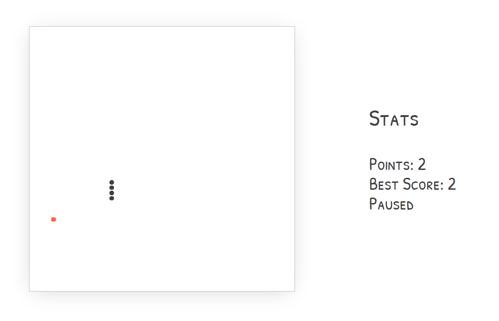

# Snakely

## A React Snake Game.

This game was built as a fun project with React, Next.js, Typescript, etc. You can find some tests written with Jest and Enzyme. Special Credits: Paper CSS, Sweet Alert, React Use Interval Hook by Dan Abramov, and all the other libraries used to get the project done. Play it here: https://snakely.now.sh

<center></center>

### Developing Locally

Install the dependencies...

```bash
# Clone the repo
git clone https://github.com/nfuad/snakely.git
# Move into the cloned repo
cd snakely
# Install the dependencies
yarn
# Start the dev server
yarn dev
```

Navigate to [localhost:3000](http://localhost:3000). You should see the app running.

### Contribute

Feel free to contribute to this repo. [Let me know](https://github.com/nfuad/snakely/issues/new) if there are any bugs/issues.

### License

[MIT](/LICENSE)
